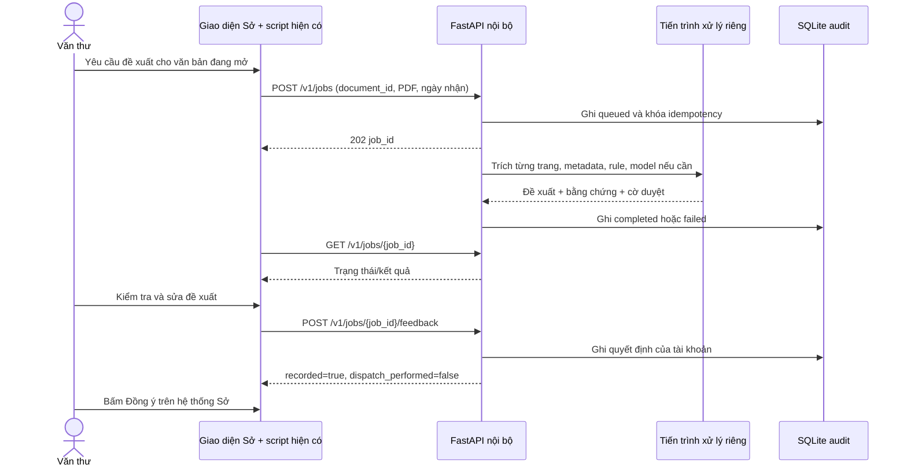

# Hợp đồng tích hợp FastAPI với client chuyển văn bản SoNNMT

Phiên bản API: 2.0. Backend cung cấp đề xuất và ghi nhận quyết định. Script hiện có của nhóm tích hợp chịu trách nhiệm lấy văn bản từ giao diện, ánh xạ danh bạ, hiển thị/điền các ô và để người dùng hoàn tất thao tác trên hệ thống Sở.

## Kiến trúc và phạm vi



Không gửi cookie/mật khẩu phiên đăng nhập hệ thống Sở sang API. Client tự lấy PDF trong phiên đăng nhập hiện tại và gửi bytes; API không nhận URL để tải hộ. Cách này cũng tránh backend phải truy cập các URL nội bộ do client cung cấp.

Khuyến nghị đặt API trên máy chủ nội bộ có HTTPS. Trường hợp chạy tại máy văn thư dùng `http://127.0.0.1:8000`; nhóm script kiểm chứng quyền truy cập mạng cục bộ của trình duyệt/extension trên máy thật. URL giao diện, URL API và external ID của danh bạ chưa được cung cấp, nên chưa cấu hình thay cho môi trường Sở.

## Ánh xạ với màn hình đã gửi

| Ô trên giao diện | Trường API | Cách dùng |
|---|---|---|
| Xử lý chính | `recipients.don_vi_xu_ly_chinh` | Danh sách có thể gồm lãnh đạo, đơn vị hoặc chức danh |
| Phối hợp xử lý | `recipients.phoi_hop_xu_ly` | Danh sách vai trò phối hợp, không gộp với theo dõi |
| Thêm người theo dõi | `recipients.lanh_dao_theo_doi` | Danh sách theo dõi |
| Hạn xử lý | `han_thuc_hien` | YYYY-MM-DD hoặc null; null nghĩa là chưa xác định, không có nghĩa xóa hạn có sẵn |
| Độ khẩn | `do_khan` | `thuong`, `khan`, `thuong_khan`, `hoa_toc`; nhóm script ánh xạ enum sang option value thật |
| Nội dung | `reason` và `evidence` | Để người dùng xem lý do; không tự ghi đè nội dung xử lý đang có |
| Đồng ý | Không có endpoint gửi | Hệ thống Sở và người dùng thực hiện; feedback không chứng minh văn bản đã chuyển |

Backend không biết ID của người/đơn vị trên hệ thống Sở. `GET /v1/directory` cung cấp `id` ổn định của router và `name` để đối chiếu. Nhóm tích hợp duy trì bảng `router_id → external_id`, được quản trị nghiệp vụ xác nhận. Không chọn người chỉ bằng fuzzy matching tên. Các mục chức danh như “Chánh Văn phòng Sở” hoặc nhóm “Lãnh đạo Sở” cần ánh xạ theo cơ cấu thật. Nếu không ánh xạ được thì yêu cầu người dùng chọn.

Ba trường tên cũ (`don_vi_xu_ly_chinh`...) vẫn được trả để đọc/hiển thị; `recipients` là danh sách `{id,name}` cùng thứ tự để tích hợp. Không nhầm ID router với option ID trên giao diện.

## Xác thực và CORS

Mỗi request nghiệp vụ có `X-API-Key: <token>`; token tối thiểu 32 ký tự ngẫu nhiên, cấu hình `ROUTER_API_KEYS={"vanthu01":"...","vanthu02":"..."}`. Owner của job/feedback được xác định từ token, không nhận tên người duyệt do client tự khai. Nếu dùng chung token thì audit chỉ phân biệt được tài khoản tích hợp chung, không phân biệt từng người; muốn truy vết từng văn thư phải cấp token riêng hoặc triển khai gateway SSO riêng.

`ROUTER_ALLOWED_ORIGINS` là mảng origin đầy đủ, ví dụ `["https://vanban.example.vn"]`, không gồm path. CORS chỉ cho GET/POST, Content-Type, X-API-Key, Idempotency-Key; không dùng cookie credentials. CORS không thay thế xác thực. Không nhúng token vào HTML hoặc log request. Token của userscript nên lưu trong kho cấu hình extension theo cơ chế nhóm đang dùng.

Client dùng request đặc quyền của Tampermonkey cần khai báo quyền và host API tương ứng. Xem [GM_xmlhttpRequest](https://www.tampermonkey.net/documentation.php?locale=en&q=GM_xmlhttpRequest) và [@connect](https://www.tampermonkey.net/documentation.php?locale=en&q=connect). Với fetch thông thường, origin phải được cho phép theo [CORS của FastAPI](https://fastapi.tiangolo.com/tutorial/cors/). Backend thực hiện OCR/inference ngoài event loop theo mô hình xử lý blocking được giải thích trong [tài liệu FastAPI](https://fastapi.tiangolo.com/async/).

## 1. Danh bạ

`GET /v1/directory` trả:

```json
{
  "department": "SoNNMT",
  "version": "<sha256 danh bạ>",
  "recipients": [
    {"id": "<ID lấy từ response thực>", "name": "Chi cục Thủy lợi"}
  ]
}
```

Cache theo version. ID đã được lưu trong file cấu hình; khi đổi tên phải giữ nguyên ID và quản trị mapping cùng nhóm script. Không sử dụng ID ví dụ làm dữ liệu thật.

## 2. Tạo tác vụ

`POST /v1/jobs`, `multipart/form-data`. Không tự đặt Content-Type/boundary nếu client đang dùng FormData.

| Field/header | Bắt buộc | Ý nghĩa |
|---|---|---|
| `document_id` | Có | ID ổn định của bản ghi văn bản trên hệ thống Sở, tối đa 200 ký tự |
| `received_on` | Nên có | Ngày nhận YYYY-MM-DD; nếu bỏ trống dùng ngày tại UTC+7 khi API nhận request |
| `file` | Một trong các đầu vào | Một PDF |
| `files` | Thay cho file | Nhiều PDF, lặp lại field cùng tên, tối đa 5 |
| `text` | Thay cho PDF | Văn bản thuần, tối đa 200.000 ký tự; dùng khi đã có toàn văn đáng tin |
| `Idempotency-Key` | Nên có | Khóa duy nhất cho một lần đề xuất của một bản ghi/phiên bản, tối đa 128 ký tự |

Không nhận text và PDF cùng lúc, tránh âm thầm bỏ qua tệp đính kèm. Tổng PDF tối đa 20 MiB và 50 trang; file không có chữ ký `%PDF-` bị từ chối ngay. PDF hỏng/mã hóa/quá số trang được trả thành job failed sau khi worker kiểm tra. Nhiều tệp được ghép theo thứ tự; metadata lấy từ đầu vào ghép và luôn yêu cầu duyệt vì có thể là nhiều văn bản khác nhau. Gửi văn bản chính trước, phụ lục sau.

Cùng owner + cùng Idempotency-Key + cùng document_id/nội dung/ngày nhận/phiên bản rule/danh bạ → trả lại job_id cũ, kể cả job đã failed. Nếu thay đầu vào mà dùng lại khóa → 409. Muốn chạy lại tác vụ thất bại, tạo khóa mới. Hai lần gửi không có khóa tạo hai job riêng.

```powershell
curl.exe -X POST https://router.example.vn/v1/jobs `
  -H "X-API-Key: YOUR_TOKEN" `
  -H "Idempotency-Key: 9634-content-r1" `
  -F "document_id=9634" -F "received_on=2026-09-08" `
  -F "file=@C:/documents/vanban.pdf"
```

Response HTTP 202:

```json
{"job_id":"<job-id>","status":"queued","result":null,"error":null}
```

Status có thể đã là running/completed nếu tác vụ xử lý rất nhanh hoặc request idempotent.

## 3. Đọc kết quả

`GET /v1/jobs/{job_id}`. Chỉ owner tạo tác vụ được đọc; token khác nhận 404. Client poll khoảng 1–2 giây, tăng lên 5 giây khi chờ lâu; dừng khi completed/failed. Mạng lỗi thì thử lại GET cùng job_id, không tạo tác vụ mới ngay.

Ví dụ đầy đủ được sinh từ worker thật với đầu vào thử trong [api-example-response.json](api-example-response.json). Các trường quan trọng:

- `document_id`: phải trùng bản ghi đang mở trước khi hiển thị/điền; người dùng chuyển văn bản trong lúc chờ thì giữ kết quả cho bản ghi cũ.
- `input_sha256`: digest của object JSON chứa text nguyên bản và danh sách SHA-256 file theo thứ tự. Echo lại nguyên giá trị khi feedback, không tự suy từ tên file.
- `rules_sha256`, `rules_version`, `directory_version`: phiên bản dùng để ra quyết định.
- `needs_review`: có thiếu dữ liệu, mơ hồ hoặc mapping cần xác nhận; `review_reasons` có mã cụ thể.
- `requires_confirmation`: luôn true ở phiên bản này. Đây là chính sách pilot ngay cả khi rule khớp rõ.
- `confidence`: điểm heuristic, chưa phải xác suất đúng đã được hiệu chuẩn; không dùng ngưỡng để tự bấm Đồng ý.
- `tier`: T0 dùng rule; T2/T1 có gợi ý từ model. Gợi ý model luôn cần duyệt.
- `degraded`: model không dùng được/kết quả bị hạ cấp; kết hợp với needs_review, không coi degraded=false là được gửi tự động.
- `extraction.files[].pages[]`: provider/status/số ký tự/cảnh báo từng trang; thiếu trang hoặc OCR rác không được che đi.
- `evidence`: keyword lĩnh vực, quan hệ trả lời, thông tin runtime. `extracted_metadata.evidence` có đoạn dùng định tuyến và các ứng viên hạn.

Độ khẩn chỉ suy từ dấu độ khẩn rõ ràng, độc lập với hạn còn 1–2 ngày. Hạn đã quá ngày nhận gây cảnh báo overdue; không tự biến thành văn bản hỏa tốc. Ngày tương đối “N ngày kể từ ngày nhận” chỉ tính khi có ngày nhận; “ngày làm việc” cần lịch ngày nghỉ nên chuyển duyệt.

## 4. Ghi nhận quyết định đã duyệt

`POST /v1/jobs/{job_id}/feedback`, JSON:

```json
{
  "document_id": "9634",
  "input_sha256": "<echo result.input_sha256>",
  "rules_sha256": "<echo result.rules_sha256>",
  "decision": "accepted",
  "final": {
    "don_vi_xu_ly_chinh": ["<router recipient id>"],
    "phoi_hop_xu_ly": [],
    "lanh_dao_theo_doi": [],
    "han_thuc_hien": "2026-09-10"
  },
  "do_khan": "thuong",
  "note": "Đã đối chiếu văn bản"
}
```

Có thể gửi thêm header `Idempotency-Key` (tối đa 128 ký tự). Với cùng owner,
job và nội dung feedback, retry dùng lại khóa này sẽ trả lại `feedback_id` cũ
và không tạo thêm bản ghi. Dùng cùng khóa cho job hoặc payload khác sẽ nhận
`409 feedback_idempotency_key_conflict`.

- `accepted`: cả 4 trường và độ khẩn giữ đúng đề xuất; backend kiểm tra.
- `edited`: người dùng đã chỉnh; mọi ID cuối phải thuộc danh bạ, xử lý chính không rỗng. Ghi chú tối đa 2.000 ký tự.
- `rejected`: `final=null`; ghi lý do nếu có.
- Sai document_id/hash → 409. Tác vụ chưa completed → 409. ID không có trong danh bạ, ngày sai hoặc dùng accepted cho kết quả đã sửa → 422.
- API phản hồi 201 với `feedback_id`, `recorded=true`, `dispatch_performed=false`. Feedback được ghi thêm, không ghi đè lịch sử. Client nên dùng `Idempotency-Key` khi cần retry sau lỗi mạng.

Feedback chỉ ghi nhận quyết định của người dùng trên đề xuất, chưa xác nhận giao dịch chuyển văn bản thành công trong hệ thống Sở. Nếu cần theo dõi giao dịch chuyển thực tế, hai nhóm phải thống nhất thêm một sự kiện có ID giao dịch từ hệ thống Sở; hiện API không giả lập trạng thái đó.

## Lỗi và thời gian chờ

| HTTP / error | Xử lý phía client |
|---|---|
| 401 invalid_api_key | Yêu cầu cấu hình lại token |
| 404 job_not_found | Kiểm tra job_id/tài khoản; không hiển thị dữ liệu người khác |
| 409 idempotency_key_conflict | Dùng khóa mới khi đổi đầu vào |
| 409 document_or_result_mismatch | Không áp dụng kết quả vào bản ghi hiện tại |
| 413 upload_limit_exceeded / request_body_too_large | Giảm kích thước/số tệp |
| 415 pdf_required | Chọn đúng file PDF |
| 422 validation error | Sửa field theo response detail |
| 429 queue_full | Theo Retry-After (5 giây), giữ nguyên khóa idempotency |
| job failed: job_timeout | Tác vụ bị dừng sau thời gian tối đa; xem lại tài liệu/OCR rồi tạo job mới |
| job failed: invalid_pdf / encrypted_pdf / page_limit_exceeded | Kiểm tra tệp hoặc chia tài liệu có kiểm soát |
| job failed: server_restarted | Backend khởi động lại; tạo tác vụ mới nếu còn cần |
| job failed: configuration_changed | Rule/danh bạ đổi trong lúc chạy; quản trị restart dịch vụ rồi chạy lại |

`POST /classify` chờ tác vụ hoàn tất và trả trực tiếp ClassifyResponse, phù hợp text hoặc file nhỏ. Cùng X-API-Key, `document_id`, `received_on`, `file`/`text`. Endpoint này đổi bảo mật/độ khẩn so với prototype cũ và có thể gặp client timeout; ưu tiên /v1/jobs cho script đang phát triển.

## Vận hành và nghiệm thu

- Chạy `uvicorn app.main:app --workers 1`. Khóa DB ngăn hai instance dùng cùng file. Hai job thực thi đồng thời là mặc định, tối đa 8 job chờ/chạy. Từng job nằm trong subprocess có timeout 300 giây để parser/model lỗi không giữ worker vô hạn.
- Reverse proxy đặt body limit khoảng 21 MiB (20 MiB file + multipart overhead), timeout upload phù hợp mạng nội bộ và TLS. Không public trực tiếp inference/OCR.
- /health kiểm tra tiến trình; /ready kiểm tra DB và cấu hình đã nạp, **không ping GPU/OCR/model từ xa**. Kiểm tra chức năng OCR thực tế bằng mẫu scan kiểm soát riêng.
- Job/feedback/toàn văn đã trích lưu SQLite; PDF tạm được xóa khi xử lý bình thường. Khi tiến trình bị hard kill, hệ điều hành có thể còn file PDF tạm; cấu hình thư mục TEMP riêng và dọn khi dịch vụ đã dừng theo chính sách nội bộ.
- Dọn dữ liệu cũ: `python tools/maintenance.py --retention-days 30`. Công cụ dùng DB từ .env; đặt lịch vận hành tại máy chủ khi cần. Backup dữ liệu đang chạy bằng SQLite backup API hoặc dừng dịch vụ trước khi sao chép DB/WAL.
- Cần xác nhận các mục trong implementation-notes.md, ánh xạ external ID, kiểm thử văn bản thật với văn thư và đo tỷ lệ sai trên tập business_approved. Không xem kết quả trên 8 trích đoạn đề xuất là accuracy vận hành.
- Trước nghiệm thu: thử đổi bản ghi khi đang chờ, gửi trùng, mất mạng, token sai, OCR không đủ trang, sửa hạn/đơn vị, tác vụ quá thời gian và server restart. Tất cả đều phải có trạng thái rõ ràng cho người dùng.
